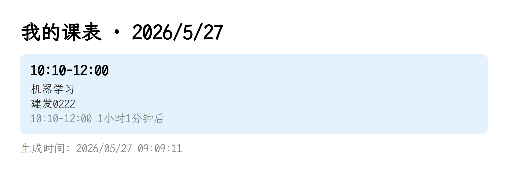
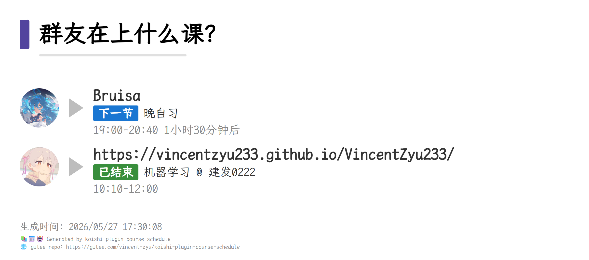
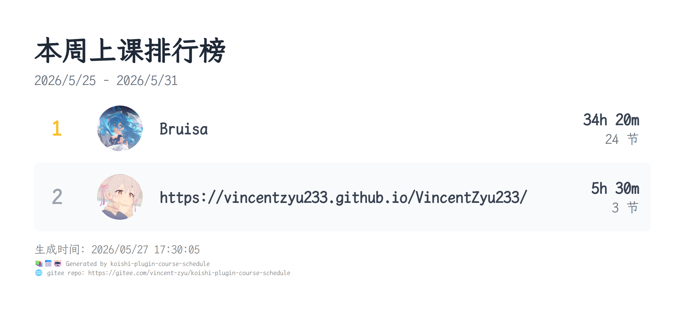
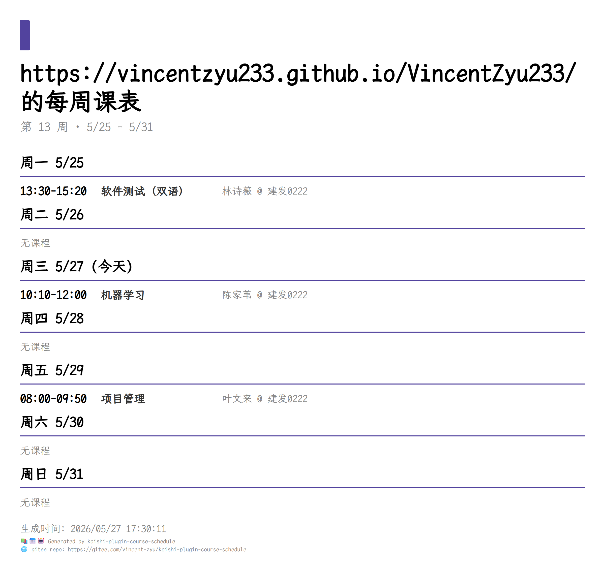

# koishi-plugin-course-schedule

📚📅 课程表插件，支持 WakeUp/星链/拾光 等课程表，ICS/JSON 等多格式导入，渲染为图片输出个人课表、群课表、周课表和排行榜 🎓🖼️✨

> 💡 readme 中的图片请前往 [GitHub](https://github.com/VincentZyu233/koishi-plugin-course-schedule) 或 [Gitee](https://gitee.com/vincent-zyu/koishi-plugin-course-schedule) 主页查看。

[](https://www.npmjs.com/package/koishi-plugin-course-schedule)
[](https://www.npmjs.com/package/koishi-plugin-course-schedule)

[](https://github.com/VincentZyu233/koishi-plugin-course-schedule)
[](https://gitee.com/vincent-zyu/koishi-plugin-course-schedule)

[](https://qm.qq.com/q/ZN7fxZ3qCq)

<p><del>💬 插件使用问题 / 🐛 Bug反馈 / 👨‍💻 插件开发交流，欢迎加入QQ群：<b>259248174</b> 🎉（这个群G了）</del></p>
<p>💬 插件使用问题 / 🐛 Bug反馈 / 👨‍💻 插件开发交流，欢迎加入新QQ群：<b>1085190201</b> 🎉</p>
<p>💡 在群里直接艾特我，回复的更快哦~ ✨</p>

---

## 📖 简介

课程表，**群u在上什么课捏**？

支持多种课表格式导入，自动渲染为图片输出，帮助群友互相了解彼此的课程安排。

## 📸 效果预览

**个人课表** — 查看自己某天的全部课程


**群课表** — 查看本群所有人某天的课程


**本周排行** — 查看本周本群上课时长排行榜


**周课表** — 查看个人周课表纵览


## ✨ 功能

### 📥 多格式导入

| 格式 | 说明 |
|------|------|
| **WakeUp 课程表** | 直接发送 WakeUp 分享口令即可导入 |
| **星链课表** | 支持星链课表分享码和 JSON 格式 |
| **拾光课表 / 原生 JSON** | 粘贴课表 JSON 文本直接导入 |
| **WakeUp 备份文件** | 支持 `.wakeup_schedule` 备份文件导入 |
| **ICS 文件/链接** | 支持 `.ics` 文件上传或 ICS 链接下载解析 |

### 📋 可用命令

```
课表.绑定 <文本/文件>     — 导入课表数据
课表.查看 [天]           — 查看个人某天课程
课表.群课表 [天]         — 查看本群所有人某天的课程
课表.排行                — 查看本周本群上课时长排行榜
课表.周课表 [周数]        — 查看个人周课表纵览
```

> 命令名称可在插件配置中自定义。

#### ⚠️ **兼容性说明**（更新于 2026-05-27，可能有时效性）
>
> 
>
> - **WakeUp 课程表** — 旧版安卓 App 使用 v1 API（无鉴权），新版使用 v2 API（有鉴权）。_对于作者自己的学校教务网站_：
>   - WakeUp 的课表导入很顺利
>   - 但口令导出功能在最新版 App 中不可用，需要降级到旧版本
>   - 据说 **≥ 6.1.x 的版本均不行，6.0.x 及以下版本可以**
>   - 作者暂时不清楚新旧版本的确切分水岭，推测大概率是 **6.0.x 与 6.1.x** 之间
>
>   因此在不同的导入方案中，**最佳选择是降级 WakeUp 到作者同款版本**（作者实测确认可用）：
>   作者使用的版本：**6.0.23**
>   - [](https://github.com/VincentZyuApps/koishi-plugin-course-schedule/releases/download/WakeUp6.0.23/WakeUp_6.0.23.apk)
>   - [](https://gitee.com/vincent-zyu/koishi-plugin-course-schedule/releases/download/WakeUp6.0.23/WakeUp_6.0.23.apk)
> - **星链课表** — _对于作者自己的学校教务网站_：没有直接的学校教务导入选项，通用的 AI 导入工具也无法使用。作者目前的导入方式：浏览器 F12 下载课表 HTML 数据 → 让 AI（如 OpenCode / Codex / Gemini）参考本地 HTML 结构与课表截图识别，生成符合星链 JSON 格式的文件 → 复制 JSON → 星链 App 右上角「+」→ 一键导课 → 粘贴 JSON → 点击 AI 解析即可完成导入。
> - **拾光课程表** — 作者暂时无法成功导入
>
> 如果你遇到了导入问题，欢迎加群反馈，帮助逐步完善适配 🙏 艾特作者回复更快哦~ @VincentZyu

### 🖼️ 渲染方式

基于 **Puppeteer** 将 HTML 模板渲染为图片输出，配置项：
- **waitUntil 策略** —— 控制渲染等待时机（load / domcontentloaded / networkidle0 / networkidle2）
- **自定义字体** —— 支持指定系统字体文件路径
- **自定义颜色** —— 主题色、卡片背景色、状态标签色均可配置

### 📅 节假日支持

内置 2026 年节假日数据，节假日自动提示休息消息，调休上班日正常显示课程。

## 📦 安装

在 Koishi 插件市场搜索 `course-schedule` 即可安装

或使用 npm / yarn：

```bash
# 先切换到koishi的根目录
cd /path/to/koishi-app
ls
# 确保能看到 package.json, koishi.yml, data文件夹
npm install koishi-plugin-course-schedule
# 或者用yarn
yarn add koishi-plugin-course-schedule
```

## ⚙️ 配置

| 配置项 | 默认值 | 说明 |
|--------|--------|------|
| `enableQuote` | `true` | 💬 开启后，所有消息都会引用回复触发指令的消息 |
| `enableWatingHint` | `true` | ⏳ 是否启用「渲染中，请稍候...」提示消息 |
| `baseCommand` | `课表` | 父级指令名称 |
| `bindCommand` | `绑定` | 绑定课表命令名 |
| `showCommand` | `查看` | 查看个人课表命令名 |
| `groupCommand` | `群课表` | 查看群友课表命令名 |
| `rankingCommand` | `排行` | 查看本周排行命令名 |
| `weekCommand` | `周课表` | 查看周课表命令名 |
| `renderWaitUntil` | `load` | Puppeteer 渲染等待策略 |
| `textFontPath` | `(空)` | 自定义字体文件路径 |
| `icsTempDir` | `path.resolve(__dirname, '..', 'tmp')` | ICS 临时文件目录（需要填写绝对路径，默认值是插件目录下的`tmp`文件夹） |
| `icsTempDeleteTime` | `300` | 临时文件自动删除时间（秒），`0`或`负数`表示永不删除 |
| `renderColors.primaryColor` | `#52449e` | 主题色 |
| `renderColors.cardBgColor` | `#E3F2FD` | 个人课表卡片背景色 |
| `renderColors.statusOngoingColor` | `#D32F2F` | 进行中标签色 |
| `renderColors.statusNextColor` | `#1976D2` | 下一节标签色 |
| `renderColors.statusFinishedColor` | `#388E3C` | 已结束标签色 |
| `verboseConsoleLog` | `false` | 详细调试日志 |

## 🔗 本插件链接

- **GitHub**: https://github.com/VincentZyu233/koishi-plugin-course-schedule
- **Gitee**: https://gitee.com/vincent-zyu/koishi-plugin-course-schedule
- **npm**: https://www.npmjs.com/package/koishi-plugin-course-schedule

## 📄 许可证

由于绝大部分上游采用强 copyleft 许可证（AGPL v3 / GPL v3），
要求修改后的代码也必须以相同许可证公开，
故本插件同样采用 **GNU Affero General Public License v3 (AGPL-3.0)** 发布。

在开发过程中参考/借鉴了以下开源项目：

| 项目 | 许可证 |
|------|--------|
| [](https://github.com/advent259141/astrbot_plugin_CourseSchedule) [astrbot_plugin_CourseSchedule](https://github.com/advent259141/astrbot_plugin_CourseSchedule) | AGPL v3 |
| [](https://github.com/GLDYM/nonebot-plugin-course-schedule) [nonebot-plugin-course-schedule](https://github.com/GLDYM/nonebot-plugin-course-schedule) | AGPL v3 |
| [](https://github.com/Temmie0125/Yunzai-Schedule-Plugin) [Yunzai-Schedule-Plugin](https://github.com/Temmie0125/Yunzai-Schedule-Plugin) | GPL v3 |
| [](https://github.com/koishi-shangxue-plugins/koishi-shangxue-apps/tree/main/plugins/curriculum-table) [【koishi-shangxue-plugins】curriculum-table](https://github.com/koishi-shangxue-plugins/koishi-shangxue-apps/tree/main/plugins/curriculum-table) | MIT |
